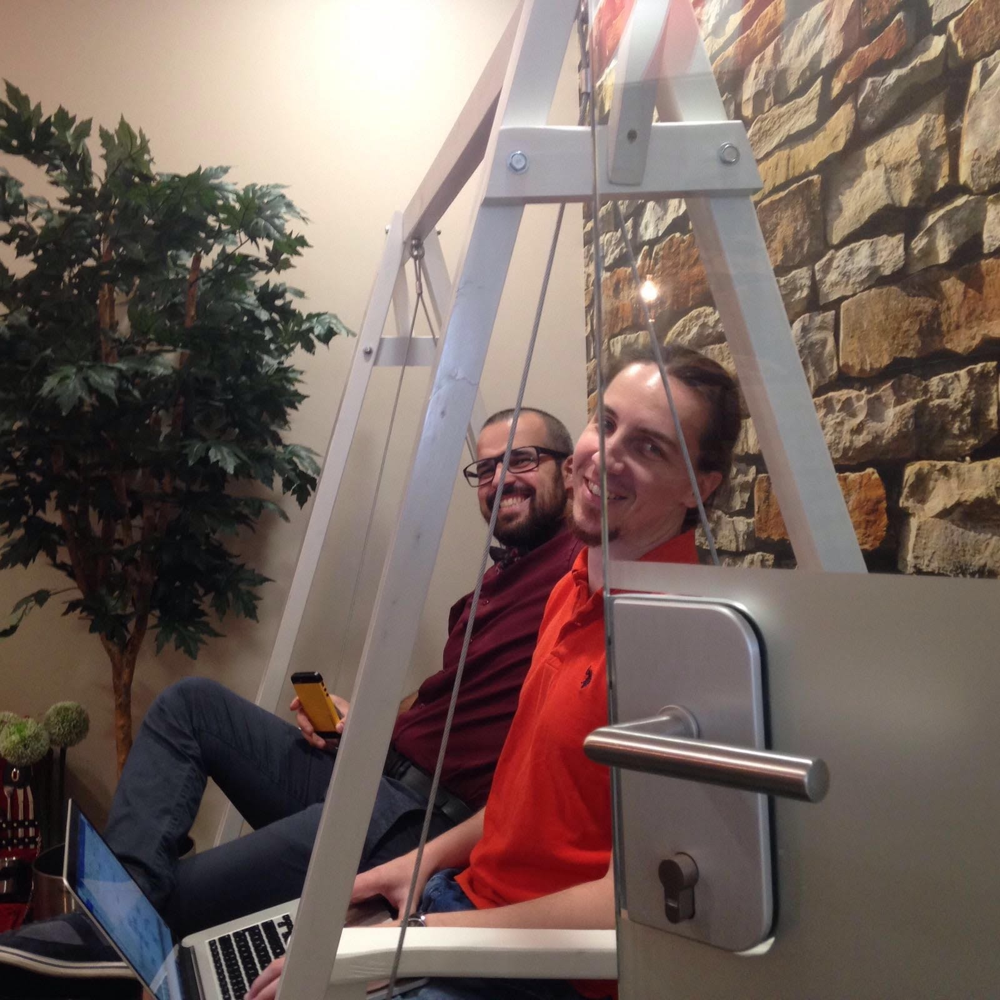
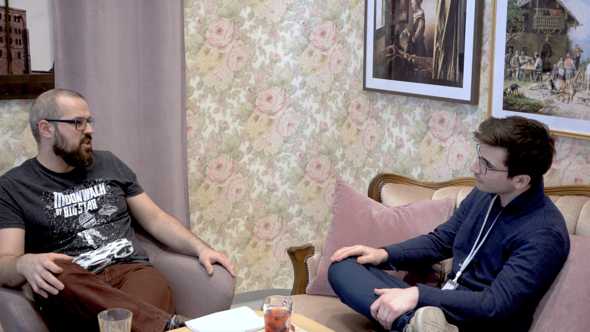
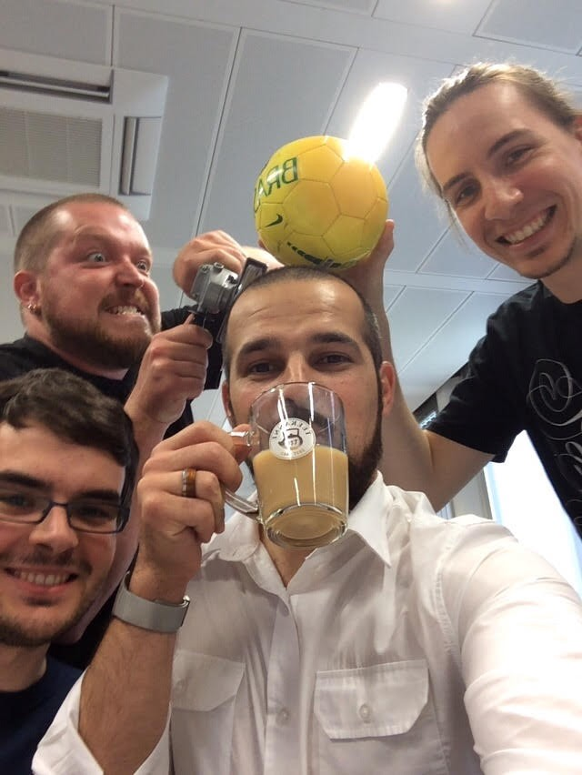
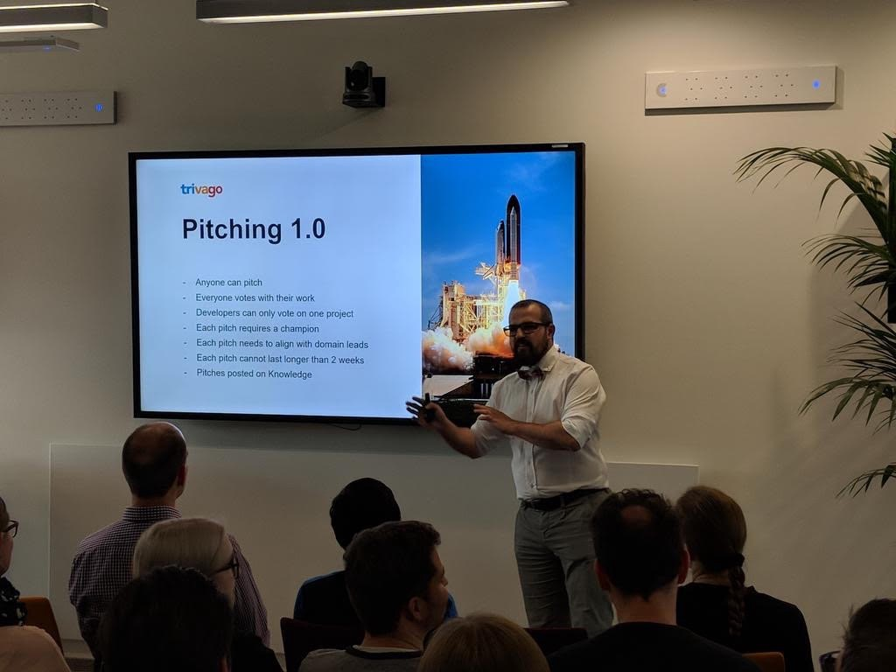

Alexandru Bleau is a seasoned product manager currently building, challenging and breaking things at trivago. In the past, he’s had the chance to work with teams on projects related to digital signage, SaaS, mobile games and physical products. He is also a co-organiser of Product Tank in Düsseldorf. In his current role at trivago, Alex focuses on individual user intents and actions to deliver a better product experience. Likes coffee and bowties.

---

## Hey Alex. Tell us about yourself, take us to where you grew up.

I was born in Timisoara, Romania. No worries, no Dracula or anything related to that. Later on, there were a lot of changes or opportunities that required travel, so I moved quite a lot. I started primary school in Romania, moved to the US at 7 years old. At 8 I was back in Romania but in a different school. 5 years later, I changed schools again. You see there’s a trend. Everything changed. Then there was a constant period of time in middle school to finally settle down. And at high-school, it started all over again.

## How does being used to change benefit you today as a PM?

I think being used to a constant change in today’s world is quite an advantage. I’ve noticed several cases where I didn’t have such a problem with radical changing environments. Trivago has had plenty of them.

We’ve been in constant growth and change and we went from 300 people back in 2010 to 700 in 2015 when I joined to more than 1200 today. We have these balloons for new people and we saw balloons every week. If you’re used to changes in people and how you work with people, then I think it makes things a lot easier.

Because if you’re not mentally stable to handle change and if you don’t rebound fast to be the stable point, as a Product Manager, your team will start grabbing on to you. But they aren’t gonna have anything to grab on to because you’re like: “I’m in the same mess, don’t look at me.”

Instead of spending time to resist the change, I think about it as a game and say okay, this is just another level in my game: How do I handle this change? How can I take advantage of and make the best of it? What can I improve? What makes sense and what doesn’t?

Then I try to rebound as fast as possible. Because of course, this change is coming. Whether you want it or not. I guess it’s quite a good quality to not be constantly upset about what’s happening around you. Just take it as it is.

## What about your team, how do you align them for a change?

There are big and there are small changes and there’s this irony that whenever we come up with change, it’s great. But when somebody else comes with change, it’s horrible. So there is this discrepancy because we need time to adapt. And of course in some cases the team is right and the change makes no sense.

Generally, as Product Manager, you get the news beforehand so you can _prepare_. And sometimes you may need some time to take it, so it may make sense to take a day off. Think about it and reflect. There’s this new boss, how is this going to affect me, how is this going affect the team? If you’re ready for the change then the team has something to latch on to.

> # _The biggest mistake that you can make, if you’re okay with the change, is to assume that everybody should be okay, too._

And when it happens, you have to be there for your team. Discuss as early as possible with each person. Sometimes it’s just about listening, not about coming up with solutions. It helps to know and relate to them. Knowing what their personal interests are. Knowing what some of their fears might be. And also their levels of insecurity. Some people are very comfortable with change, others really love that window seat. And they perform best when they are at the window seat and the sun is shining.

So it’s not a one size fits all thing. The sooner you get to talk to them, the better. And generally, my approach is, I first talk to them individually and ask: „What do you think about this? It might be a change coming“. Or sometimes directly collectively. Because if you know that people are gonna talk about, you might as well just say: “Well okay look, there is this change coming, we need to prepare for it, it’s not as bad as it seems.”

The biggest mistake that you can make, if you’re okay with the change, is to assume that everybody should be too. Because everybody won’t be okay. This is a big change. You have to understand what people are going to go through if you have to have any hope. So to answer your question, you really need to find your best way to let them speak out what they fear about the change. Otherwise, there is no hope for you to actually mitigate any of the damage and it will only take longer for you to go through the change.

_Alex & Tauan_

## What does your schedule at work look like?

At one point in time, I was in this deliberate step, I used to have a lot of meetings. And generally at meetings, you get a list of more things to do.

So I thought it might make more sense to have fewer days where I get stuff to do and more days of actually working with the team. And so my brute approach was: I will block 3 days of the week for my team. And they will forever be blocked. I reserve time especially for urgent meetings, work sessions with the team, and being there for the team when they want to.

The other two are available for meetings, left empty and people can just block things out where they want. This brute approach wasn’t necessarily thought of as good by a lot of people. But it works and only a few people have ever mentioned that it’s impossible to book me for a meeting.

## Which days of the week do you reserve for your team?

Monday, Wednesday, and Friday. Monday is Sprint planning and weekly next-up meetings. It’s the start of the week and I don’t want to block my team because they are looking for a decision. So Monday I’m there, I’m at my desk most of the time. Looking over what we have done and what are we doing. And then Wednesday and Friday are blocked to cover the rest of the week and react to anything new from the work or the meetings.

## What are some challenges that you currently face as a product manager?

Up until last year, I was working mainly with the interface teams at trivago and this was a lot of exciting front-end work. We were building a lot of features and visual experiences for users on trivago. And then I moved to user profiling which is a more back-end approach. And I completely had to come out of my comfort zone in that area and there’s a lot to learn. Since most of the teams in user profiling are working with some heavy algorithms in order to use our data. With machine learning and new frameworks, that fear of missing out starts to bubble up pretty quick.

So let’s say one of the main challenges right now is to know exactly what part of knowledge I should focus on to be most efficient for my team. So instead of going through all of the algorithms, I go through what are performance metrics that I can use, what are things to look out for when using this specific algorithm. So my focus is: What knowledge do I need to ask better questions in our team meetings. And I leave the how and the actual implementation to the team.

_The interview setting_

## How do you handle not knowing everything?

We’re always in this state where we don’t know stuff. The difference is, are you aware of it or not? If you look at your knowledge as fear, the more we gain it, the more touch points this fear now has — and the less you’re aware of what you actually know. You’ll just discover how much more you don’t know.

So my approach to this is that I shouldn’t know everything and the team should not limit itself only to my knowledge. So by that definition, my job is not to know everything but to know how to pull the critical knowledge from the rest of the team members. How do I get them to work together? How do I get them to surface out their knowledge?

Because I’m not the expert on data analytics, I’m not the expert on building prediction models, I’m not the expert on building a whole architectural service, but it seems that in the team you have these people already. So my priority is not on me knowing. My priority is: How do I get the people that do know, to work on the right problems at the right time?

## How did you realize you leveled up in your profession?

For a long time professionally, I was focused on generating value as a sole contributor. This is the complete opposite of product management. I was thinking about what I could do to deliver value to the team. How can I stand out as the value creator? And as a Product Manager, you’re going to get disappointed fast with that focus.

As I grew with more and more challenges I realized that most of the time I cannot work on making stuff, because I have to talk to stakeholders, prioritize, set up work sessions, support or drive decisions. So if you perceive your value from the maker’s approach, you’re gonna be in pain most of the time.

So first, I had to move from _me_ being the main value deliverer, to ask myself: How can I support _the team_ in delivering value?

Then you zoom out and ask: How can I maximize the value that the team is delivering in the perspective of the whole department?

And then the final one is: What should my team and department work on now so that the company moves forward faster?

These different perspectives will take you from „I need to do this so that people see me“ to „this team really needs to now support these other four teams.” And that’s hard. Because it means that most of the time it’s not you that’s going to be seen. It’s not you that’s going to be noticed, and in some cultures, you’re going to be invisible and sometimes you even get penalized for doing the right thing.

## In one talk of yours, you mentioned that the PM is kind of an unsung hero. How does this relate?

In the ideal case, the end goal of a team lead is to become redundant. So you do your job so well, you set up all the processes and you supported the team so well, that now the team is able to do 90% of the work without you.

If you would go out on vacation things would run at close to 100% efficiency because the team is clear on what they need to do and why they need to do it. Even without you there. It’s been clarified by the time you go on vacation. So you are free to go.

> # The credit is not yours. It’s the makers’.

To do that, the team needs to own the problem. The team needs to be credited for solving the problem. The team needs to be rewarded for giving a damn about the problem. The credit is not yours. It’s the makers’. If you want them to invest and burn the midnight oil thinking about how they can squash that bug then the credit and the praise of the work coming from everyone is currency. And that is how you pay, you transfer it to the team.

_Team grinding the PO_

And every time I hear some manager or another team saying: “Congratulations Alex for your release.” I’m like: “Thank you, I’ll forward that to the team” Always. No exceptions. Very publicly.

Then the team will get that on the next stand up or in a slack message: “Hey guys, just so you know: That team congratulated you.” And the side effect to that is now they know that that team is rooting for them which creates alignment and closeness to bind the teams together. Which comes to a higher level of you being the glue at inter-team level.

The better you do your job the more you’re out of the way and the team can still do things. The more you claim for yourself, the less you can demand from the team and the less you can allow them to grow. But allowing them to grow is your end goal. Like a soccer coach.

## How did you encounter this unusual level of empathy?

This is assuming that I have it. I might not have it. But let’s assume that I have it. I would answer your question by saying: Pain.

I was born with my right leg shorter. When I was 7 years old, I went to the US for an operation. The operation was supposed to extend my right leg. With seven years old, it’s definitely not your idea of going to the park on Sunday. And it changed my life. It’s going through pain and going through suffering and going through challenging situations whether you choose them or not, that actually gives you more perspective and the whole bandwidth of what this world is about, right?

So when somebody tells you that they have a hard time, you start resonating. When you’ve been heartbroken or when somebody from your family dies, you may start understanding and you know what that person is going through. And even if you don’t know what needs to be done, at least just listen. At any given time there are people going through something. This is just life. And life doesn’t care. If you look to the person next to you, they probably had some really tough times, they’re going through their own problems.

And it’s hard enough with people from the same culture, but at trivago, we have also people coming from completely different continents. So not only do they have a new job, they have a new culture, they have a new way of doing things. If you’re from Japan, most Japanese streets don’t even have street names. They think in blocks and buildings. Just imagine that. And then you come here. Of course, everything is alien. This all adds up. And when you say “I don’t care, you’re supposed to be productive in that week”, that doesn’t help. The more you understand, the more you’ll see why things aren’t happening. Then you can do one-on-one and ask: “Do you need help with that?”. So pain and challenging situations create empathy.

## What habits have you developed to keep the team fast and user-centered?

One of them is the speed of making decisions. There are these famous Jeff Bezos Type 1 and Type 2 decisions. And it’s not only about making decisions fast. It’s also about how to challenge the team to make decisions fast. If I see that we’re constantly repeating something and they constantly ask me for this, I stop and ask: Am I really needed in this decision making? Why? How can I remove myself from this? So when I’m not there, what are the steps that I need to make so that the team is comfortable with making the decisions. Give them exactly the barriers and boundaries of where they can play in. And they can make decisions on the spot faster. Just because we’ve clarified this.

The second one is about how we look at data and how we de-bias ourselves. Balancing qualitative and quantitative is crucial for every decision that we do. Because the quantitative is sort of a rear-view mirror. I can only see what people did. For example, A&B Test data will never tell you why users did it. And that’s where the qualitative data comes in. That’s where you see “oh, wow”, now I understand why they didn’t click on the buttons below.

And to zoom-out comes third. This is a lesson I learned the hard way but sometimes it doesn’t make sense to do something. Teams are very good at solving problems, at removing pain from the user. But we have to ask ourselves, is solving this really worth it? How many users are affected by this? Is this 0,001%? Then it has to stop immediately. Because we might have 50% of other people that might be delighted by us building this other feature. By default, if you’re making something, you’re going deep into the problem. This is where you have to zoom out. It’s very hard to make and reflect at the same time.

_Alex speaking in Karlsruhe_

## Thinking about the younger Alex, what’s your advice to handle emotional reactions at your job?

I had this colleague and we had huge divergence in whether a bug was critical or not. And there was something in what he sad, how he said or what he did, that triggered me and I said: “I don’t care what you say.”

So you have the trigger, you have your state and your emotions and, well, your reaction. Because when you’re tired or when you’re under stress we no longer have the energy to consciously drive decisions. That’s where mental reflexes kick in.

> # Whenever I wouldn’t be proud or happy with my reaction I would write it down.

Whenever I wouldn’t be proud or happy with my reaction I would write it down: I reacted like this. And I ask myself: Was it something that the colleague said, or did? Was that normally supposed to get that reaction from me? No? So why did you react that way? What can I do in the future instead? That’s growing.

Women have this superpower that when they’re sad, they sometimes let it out and cry. Men go to a cave. Like “I’m going to figure this out by myself”. But it’s important to not keep the bomb inside. You get more stable by venting steam. If you starve too much of that inside, how are you supposed to have a clear mind to focus at work? You need to let it out to yourself or to somebody that you can trust and have this thought sparring partner.

## Sparring Partner… Do you mean someone that challenges you honestly?

Yes. Find someone that constantly says, when something is crap: “That’s crap.” You cannot afford yourself to be biased. Because the whole team and the company is relying on you to deliver. A biased self leads to a biased team.

It would be foolish to listen to Feedback that is not true but you would be downright stupid to not listen to Feedback that is true.

You need to have that truth. But there’s no such thing as objective. The term objective was created just to understand subjective better. I cannot look at the whole forest at the same time. What I can do, is listen to honest sparring partners.

## Thanks a lot, Alex. Where can people find you?

I’m on twitter, my handle is [@bleau](https://twitter.com/Bleau). That’s my personal branding success.

Sometimes I might not answer immediately because when I go home my son is there and we need to build that lego crane because otherwise, the world will collapse. But when I have some time, I’m more than happy to talk.

_The interview was conducted on March 5th, 2019 on the trivago Campus in Düsseldorf._
